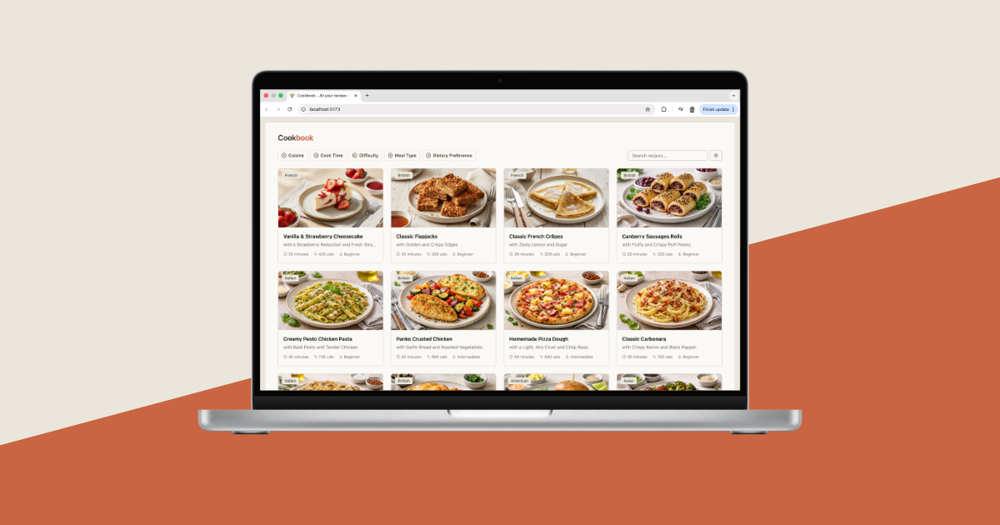

# Cookbook: all your recipes in one place

A full-stack recipe management app built with the **PERN stack (PostgreSQL, Express, React, Node.js)**.  
Save, organize, and discover recipes all in one place — built for food lovers and home cooks.



## Table of Contents

- [About the Project](#about-the-project)
- [Features](#features)
- [Getting Started](#getting-started)
- [Development and Testing](#development-and-testing)
- [Development Plan and Improvements](#development-plan-and-improvements)
- [Project Structure](#project-structure)
- [Contributing](#contributing)
- [License](#license)
- [Support](#support)

## About the Project

Cookbook is a modern, full-stack web app that lets users create, store, and share their favorite recipes.  
It features a fast React frontend, a secure Node/Express API, and a PostgreSQL database for reliable data storage.

Whether you’re tracking your family’s secret recipes or exploring new cuisines, **Cookbook keeps everything organized and searchable**.

## Features

- Create, edit, and delete recipes  
- Search recipes by name, ingredient, or category  
- Upload and view recipe images  
- Simple, responsive UI built with React and Tailwind  
- Dockerized backend and database setup for easy development

## Getting Started

### Prerequisites

Before getting started, ensure you have the following installed:
- [Node.js (>=18)](https://nodejs.org/)
- [npm](https://www.npmjs.com/)
- [Docker](https://www.docker.com/)

### Installation

Follow these steps to set up the application locally:

### 1. Clone the repository:

```bash
git clone https://github.com/imseanconroy/cookbook.git
cd cookbook
```

### 2. Frontend Setup:
   
1. **Install Dependencies**: Navigate to the `frontend` directory and install required dependencies:
```bash
cd frontend
npm install
```

2. **Configure Environment Variables**: Create a `.env` file in the frontend directory with the following content:
```env
VITE_API_BASE_URL=http://localhost:8000
```

3. **Start Frontend Development Server**: Run the following command to start the frontend development server:
```bash
npm run dev
```

### 2. Backend & Database Setup:

1. **Install Backend Dependencies**: Navigate to the `backend` directory and install the required dependencies:
```bash
cd backend
npm install
```

2. **Configure Environment Variables**: Create a `.env` file in the `backend` directory with the following content:
```env
PORT=8000
NODE_ENV=development
READ_ONLY=false

SESSION_SECRET=example
SESSION_EXPIRES_IN=1d

FRONTEND_ORIGIN=http://localhost:5173

PGADMIN_DEFAULT_EMAIL=<pg_admin_email>
PGADMIN_DEFAULT_PASSWORD=<pg_admin_password>

POSTGRES_PASSWORD=<database_password>
POSTGRES_USER=<database_user>
POSTGRES_DB=<database_name>
POSTGRES_PORT=5432
POSTGRES_HOST=localhost

DATABASE_URL=postgres://${POSTGRES_USER}:${POSTGRES_PASSWORD}@${POSTGRES_HOST}:${POSTGRES_PORT}/${POSTGRES_DB}
```

3. **Start Docker Container**: Run the following command to start the Docker container:
```env
docker compose up -d
```

4. **Access PGAdmin**: Open your browser and go to `localhost:5050` to log in to PGAdmin using the credentials defined in the .env file. Once logged in, connect to PostgreSQL and connect to the database matching the name defined in `{POSTGRES_DB}`.

5. **Run Database Migrations**: Use PG-migrate to set up the database tables by running:
```
DATABASE_URL=postgres://${POSTGRES_USER}:${POSTGRES_PASSWORD}@${POSTGRES_HOST}:${POSTGRES_PORT}/${POSTGRES_DB} npm run migrate:up
```

6. **Start Backend Development Server**: Run the following command to start the backend development server:
```bash
npm run dev
```

## Development and Testing

Run all backend tests with the following command:
```bash
cd backend
npm run test
```

## Development Plan and Improvements

This section outlines upcoming features and improvements:

1. **User Features:**
   - Add admin dashobard to create, update and delete recipes.
   - Add autocomplete and suggestions to improve search usability.
   - Add local bookmarking and “favorites” functionality.

2. **Testing and Quality Assurance:**
   - Expand test coverage for frontend components.

3. **Documentation:**
   - Create a detailed API reference.

Feel free to suggest additional improvements by [opening an issue](https://github.com/ImSeanConroy/cookbook/issues/new/choose).

## Project Structure

```
cookbook/
├── frontend/                  # React application for the user interface
├── backend/                   # Express.js server with PostgreSQL integration
│   ├── migrations/            # Database migration files
│   ├── test/                  # Backend tests
│   ├── src/                   # Backend source code
│   │   ├── config/            # Database and environment configurations
│   │   ├── controllers/       # API request handlers
│   │   ├── middleware/        # Request processing logic
│   │   ├── repositories/      # Database queries and schema models
│   │   ├── routes/            # API endpoint definitions
│   │   ├── services/          # Core business logic
│   │   └── util/              # Utility functions (e.g., validation, logging)
└── README.md                  # Project documentation
```

## Contributing

Contributions are welcome. Please open an issue or submit a pull request for any enhancements or bug fixes.

## License

This project is licensed under the MIT License - see the [LICENSE](LICENSE) file for information.

## Support

If you are having problems, please let me know by [raising a new issue](https://github.com/ImSeanConroy/cookbook/issues/new/choose).
