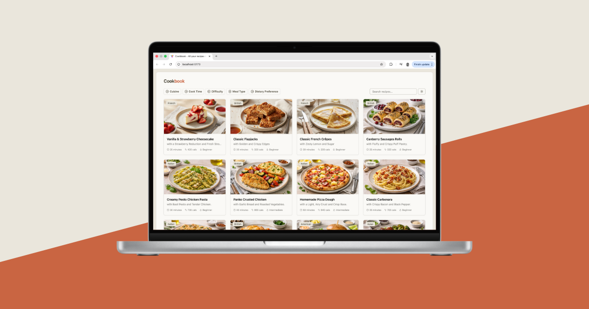

# Cookbook: All Your Recipes in One Place

A full-stack recipe management app built with the **PERN stack (PostgreSQL, Express, React, Node.js)**.  
Save, organize, and discover recipes all in one place — built for food lovers and home cooks.

 

## Table of Contents

- [About the Project](#about-the-project)
- [Features](#features)
- [Getting Started](#getting-started)
  - [Prerequisites](#prerequisites)
  - [Option 1 — Run with Docker (Recommended)](#option-1--run-with-docker-recommended)
  - [Option 2 — Run Manually (Without Docker)](#option-2--run-manually-without-docker)
- [Development, Testing and Linting](#development-testing-and-linting)
- [Production Deployment](#production-deployment)
  - [Prerequisites](#prerequisites-1)
  - [Deploy to AWS EC2 with Docker](#deploy-to-aws-ec2-with-docker)
  - [Updating to a new release](#updating-to-a-new-release)
  - [Stopping the application](#stopping-the-application)
- [Development Plan and Improvements](#development-plan-and-improvements)
- [Project Structure](#project-structure)
- [Contributing](#contributing)
- [License](#license)
- [Support](#support)

## About the Project

Cookbook is a modern, full-stack web app that lets users create, store, and share their favorite recipes.  
It features a fast React frontend, a Node/Express API, and a PostgreSQL database for reliable data storage.

Whether you’re tracking your family’s secret recipes or exploring new cuisines, **Cookbook keeps everything organized and searchable**.

## Features

- Create, edit, and delete recipes.
- Search recipes by name and subtitle.
- Filter recipes by cuisine, cook time, difficulty, meal type, and dietary requirements.
- Simple, responsive UI built with React, Tailwind, and shadcn/ui.
- Dockerized backend and database setup for easy development.

## Getting Started

### Prerequisites

Before getting started, ensure you have the following installed:

- [Node.js (>=18)](https://nodejs.org/)
- [npm](https://www.npmjs.com/)
- [Docker](https://www.docker.com/)

### Option 1 — Run with Docker (Recommended)

This runs PostgreSQL, Backend, Frontend, and PGAdmin in containers:

1. **Clone the repository:**

```bash
git clone https://github.com/imseanconroy/cookbook.git
cd cookbook
```

2. **Start the development environment:**

```bash
docker compose -p cookbook --env-file docker/env/.env.dev -f docker/compose/docker-compose.dev.yaml up --build -d
```

3. **Run database migrations:**

```bash
docker compose -p cookbook --env-file docker/env/.env.dev -f docker/compose/docker-compose.dev.yaml exec backend npm run migrate:up
```

4. **Seed the database (Optional):**

```bash
docker compose -p cookbook --env-file docker/env/.env.dev -f docker/compose/docker-compose.dev.yaml exec backend npm run seed
```

5. **Verify the application is running:**

```bash
# Check all containers are running
docker compose -p cookbook --env-file docker/env/.env.dev -f docker/compose/docker-compose.dev.yaml ps

# Tail logs
docker compose -p cookbook --env-file docker/env/.env.dev -f docker/compose/docker-compose.dev.yaml logs -f
```

6. **Access the application:**
 
- Frontend (React App) - http://localhost:5321
- Backend API - http://localhost:9001
- PGAdmin (Database GUI) - http://localhost:5051


7. **To stop the application:**

```bash
docker compose -p cookbook --env-file docker/env/.env.dev -f docker/compose/docker-compose.dev.yaml down
```

### Option 2 — Run Manually (Without Docker)

This runs PostgreSQL, backend, and frontend directly on your machine (without Docker):

1. **Clone the repository:**

```bash
git clone https://github.com/imseanconroy/cookbook.git
cd cookbook
```

2. **Install backend dependencies**:

```bash
cd backend
npm install
```

1. **Configure backend environment variables**: Copy the example env file and fill in your values:

```bash
cp .env.example .env
nano .env
```

4. **Create the database tables and seed the database**:

```bash
DATABASE_URL=postgres://${POSTGRES_USER}:${POSTGRES_PASSWORD}@${POSTGRES_HOST}:${POSTGRES_PORT}/${POSTGRES_DB} npm run migrate:up && npm run seed
```

5. **Start backend express server**:

```bash
npm run dev
```

6. **Install frontend dependencies:**

```bash
cd frontend
npm install
```

7. **Configure frontend environment variables**: Copy the example env file and fill in your values:

```bash
cp .env.example .env
nano .env
```
8. **Start the frontend react application:**

```bash
npm run dev
```

## Development, Testing and Linting

Use these commands during development to keep local quality checks aligned with CI:

1. **Run backend linting:**

```bash
cd backend
npm run lint
```

2. **Run backend tests:**

```bash
cd backend
npm run test
```

3. **Run frontend linting:**

```bash
cd frontend
npm run lint
```

4. **Run frontend production build check (recommended before pushing):**

```bash
cd frontend
npm run build
```

## Production Deployment

The pre-built Docker images on Docker Hub use **runtime environment injection** for the frontend, meaning the image will work with any configuration.

### Prerequisites

Before getting started, ensure you have the following:

- An EC2 instance (AWS Linux recommended) with Git, Docker and Docker Compose installed.
- Ports **80** (or your chosen `FRONTEND_PORT`) and **5000** (or `BACKEND_PORT`) open in the EC2 security group.
- A domain name pointed at the EC2 public IP *(optional but recommended for HTTPS)*.

### Deploy to AWS EC2 with Docker

1. **Clone the repository:**

```bash
git clone https://github.com/imseanconroy/cookbook.git
cd cookbook
```

2. **Configure environment variables:** Copy the example prod env file and fill in your values:

```bash
cp docker/env/.env.prod.example docker/env/.env.prod
nano docker/env/.env.prod
```

3. **Pull and start the containers:**

```bash
docker compose -p cookbook --env-file docker/env/.env.prod -f docker/compose/docker-compose.prod.yaml pull
docker compose -p cookbook --env-file docker/env/.env.prod -f docker/compose/docker-compose.prod.yaml up -d
```

4. **Run database migrations and seed (one-off container):** Run this once on first deploy (and again after any schema-changing release):

```bash
docker run --rm --env-file docker/env/.env.prod --network cookbook_cookbook_network -v $(pwd)/backend:/app -w /app node:24-alpine sh -c "npm install && npm install node-pg-migrate ts-node typescript && DATABASE_URL=postgres://${POSTGRES_USER}:${POSTGRES_PASSWORD}@${POSTGRES_HOST}:${POSTGRES_PORT}/${POSTGRES_DB} npm run migrate:up && npm run seed"
```

5. **Verify the deployment:**

```bash
# Check all containers are running
docker compose -p cookbook --env-file docker/env/.env.prod -f docker/compose/docker-compose.prod.yaml ps

# Tail logs
docker compose -p cookbook --env-file docker/env/.env.prod -f docker/compose/docker-compose.prod.yaml logs -f
```

### Updating to a new release

```bash
docker compose -p cookbook --env-file docker/env/.env.prod -f docker/compose/docker-compose.prod.yaml pull
docker compose -p cookbook --env-file docker/env/.env.prod -f docker/compose/docker-compose.prod.yaml up -d
```

Run migrations after any release that contains schema changes.

### Stopping the application

```bash
docker compose -p cookbook --env-file docker/env/.env.prod -f docker/compose/docker-compose.prod.yaml down
```

## Development Plan and Improvements

This section outlines upcoming features and improvements:

1. **User Features:**
   - Add PDF recipe generation.
   - Add automatic image generation.
   - Add local bookmarking and “favorites” functionality.

2. **Testing and Quality Assurance:**
   - Expand test coverage for frontend components.

3. **Documentation:**
   - Create a detailed API reference.

Feel free to suggest additional improvements by [opening an issue](https://github.com/ImSeanConroy/cookbook/issues/new/choose).

## Project Structure

```
cookbook/
├── frontend/                  # React application for the user interface
├── backend/                   # Express.js server with PostgreSQL integration
│   ├── migrations/            # Database migration files
│   ├── test/                  # Backend tests
│   ├── src/                   # Backend source code
│   │   ├── config/            # Database and environment configurations
│   │   ├── controllers/       # API request handlers
│   │   ├── middleware/        # Request processing logic
│   │   ├── repositories/      # Database queries and schema models
│   │   ├── routes/            # API endpoint definitions
│   │   ├── services/          # Core business logic
│   │   └── util/              # Utility functions (e.g., validation, logging)
├── docker/                    # Docker configuration files
└── README.md                  # Project documentation
```

## Contributing

Contributions are welcome. Please open an issue or fork the repository, create a new branch (`feature/your-feature-name`) and submit a pull request for any enhancements or bug fixes.

## License

This project is licensed under the MIT License - see the [LICENSE](LICENSE) file for information.

## Support

If you are having problems, please let me know by [raising a new issue](https://github.com/ImSeanConroy/cookbook/issues/new/choose).
