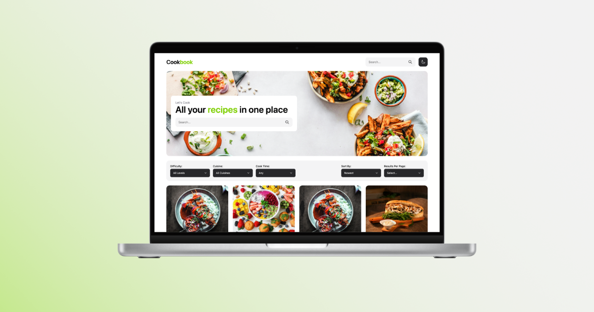

# Cookbook: all your recipes in one place

A full-stack recipe management app built with the **PERN stack (PostgreSQL, Express, React, Node.js)**.  
Save, organize, and discover recipes all in one place — built for food lovers and home cooks.

<!--  -->

## Table of Contents

- [Table of Contents](#table-of-contents)
- [About the Project](#about-the-project)
- [Features](#features)
- [Getting Started](#getting-started)
  - [Prerequisites](#prerequisites)
  - [Option 1 — Run with Docker (Recommended)](#option-1--run-with-docker-recommended)
  - [Option 2 — Run Manually (Without Docker)](#option-2--run-manually-without-docker)
- [Development and Testing](#development-and-testing)
- [Development Plan and Improvements](#development-plan-and-improvements)
- [Project Structure](#project-structure)
- [Contributing](#contributing)
- [License](#license)
- [Support](#support)

## About the Project

Cookbook is a modern, full-stack web app that lets users create, store, and share their favorite recipes.  
It features a fast React frontend, a Node/Express API, and a PostgreSQL database for reliable data storage.

Whether you’re tracking your family’s secret recipes or exploring new cuisines, **Cookbook keeps everything organized and searchable**.

## Features

- Create, edit, and delete recipes (Under Development).
- Search recipes by name and subtitle.
- Filter recipes by cuisine, cooktime, difficulty, meal type and dietary requirements.
- Simple, responsive UI built with React, Tailwind and Shadcn.
- Dockerized backend and database setup for easy development.

## Getting Started

### Prerequisites

Before getting started, ensure you have the following installed:
- [Node.js (>=18)](https://nodejs.org/)
- [npm](https://www.npmjs.com/)
- [Docker](https://www.docker.com/)

### Option 1 — Run with Docker (Recommended)

This runs PostgreSQL, Backend, Frontend, and PGAdmin in containers:

1. **Clone the repository:**
```bash
git clone https://github.com/imseanconroy/cookbook.git
cd cookbook
```

2. **Start the development environment:**
```bash
docker compose --env-file docker/env/.env.dev -f docker/compose/docker-compose.dev.yaml up --build -d
```

3. **Run database migrations:**
```bash
docker compose --env-file docker/env/.env.dev -f docker/compose/docker-compose.dev.yaml exec backend npm run migrate:up
```

4. **Seed the database (Optional):**
```bash
docker compose --env-file docker/env/.env.dev -f docker/compose/docker-compose.dev.yaml exec backend npm run seed
```

5. **Access the application:**
 
- Frontend (React App) - http://localhost:5173
- Backend API - http://localhost:8000
- PGAdmin (Database GUI) - http://localhost:5050

6. **To stop the application:**
```bash
docker compose --env-file docker/env/.env.dev -f docker/compose/docker-compose.dev.yaml down -v
```

### Option 2 — Run Manually (Without Docker)

This runs PostgreSQL, Backend, Frontend, and PGAdmin in containers:

1. **Clone the repository:**

```bash
git clone https://github.com/imseanconroy/cookbook.git
cd cookbook
```

2. **Install backend dependencies**:
```bash
cd backend
npm install
```

3. **Configure backend environment variables**:
```env
PORT=8000
NODE_ENV=development
READ_ONLY=false

FRONTEND_ORIGIN=http://localhost:5173

POSTGRES_PASSWORD=<database_password>
POSTGRES_USER=<database_user>
POSTGRES_DB=<database_name>
POSTGRES_PORT=5432
POSTGRES_HOST=localhost
```

4. **Create the database tables and seed the database**:
```
DATABASE_URL=postgres://${POSTGRES_USER}:${POSTGRES_PASSWORD}@${POSTGRES_HOST}:${POSTGRES_PORT}/${POSTGRES_DB} npm run migrate:up && npm run seed
```

5. **Start backend express server**: 
```bash
npm run dev
```

6. **Install frontend dependencies:**
```bash
cd frontend
npm install
```

7. **Configure frontend environment variables:** 
```env
VITE_API_BASE_URL=http://localhost:8000
```

8. **Start the frontend react application:**
```bash
npm run dev
```

## Development and Testing

Run all backend tests with the following command:
```bash
cd backend
npm run test
```

## Development Plan and Improvements

This section outlines upcoming features and improvements:

1. **User Features:**
   - Add ability to create, update and delete recipes from the fronted.
   - Add local bookmarking and “favorites” functionality.

2. **Testing and Quality Assurance:**
   - Expand test coverage for frontend components.

3. **Documentation:**
   - Create a detailed API reference.

Feel free to suggest additional improvements by [opening an issue](https://github.com/ImSeanConroy/cookbook/issues/new/choose).

## Project Structure

```
cookbook/
├── frontend/                  # React application for the user interface
├── backend/                   # Express.js server with PostgreSQL integration
│   ├── migrations/            # Database migration files
│   ├── test/                  # Backend tests
│   ├── src/                   # Backend source code
│   │   ├── config/            # Database and environment configurations
│   │   ├── controllers/       # API request handlers
│   │   ├── middleware/        # Request processing logic
│   │   ├── repositories/      # Database queries and schema models
│   │   ├── routes/            # API endpoint definitions
│   │   ├── services/          # Core business logic
│   │   └── util/              # Utility functions (e.g., validation, logging)
├── docker/                    # Docker configuration files
└── README.md                  # Project documentation
```

## Contributing

Contributions are welcome. Please open an issue or fork the repository, create a new branch (`feature/your-feature-name`) and submit a pull request for any enhancements or bug fixes.

## License

This project is licensed under the MIT License - see the [LICENSE](LICENSE) file for information.

## Support

If you are having problems, please let me know by [raising a new issue](https://github.com/ImSeanConroy/cookbook/issues/new/choose).
